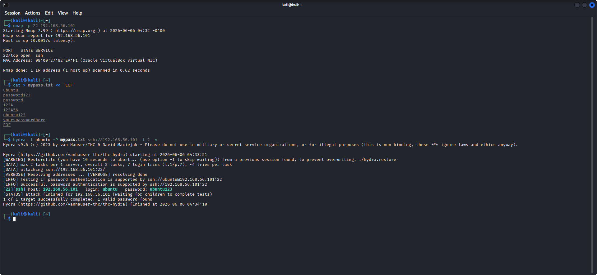
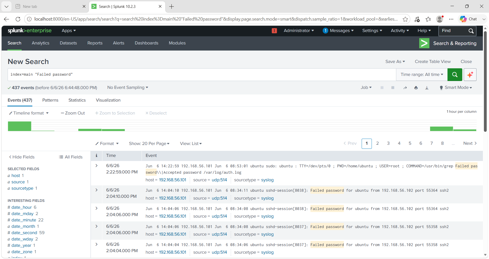
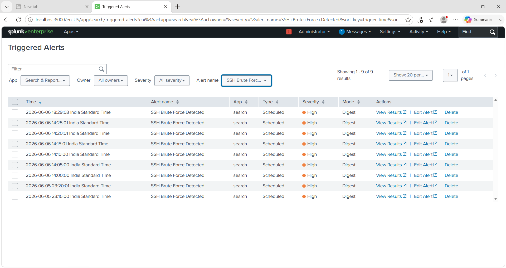

<div align="center">

<svg xmlns="http://www.w3.org/2000/svg" viewBox="0 0 900 320" width="900" height="320">
  <defs>
    <linearGradient id="bg" x1="0%" y1="0%" x2="100%" y2="100%">
      <stop offset="0%" style="stop-color:#0d1117"/>
      <stop offset="50%" style="stop-color:#0f1923"/>
      <stop offset="100%" style="stop-color:#0d1117"/>
    </linearGradient>
    <linearGradient id="redGlow" x1="0%" y1="0%" x2="100%" y2="0%">
      <stop offset="0%" style="stop-color:#ff0040"/>
      <stop offset="100%" style="stop-color:#ff6b35"/>
    </linearGradient>
    <linearGradient id="greenGlow" x1="0%" y1="0%" x2="100%" y2="0%">
      <stop offset="0%" style="stop-color:#00ff88"/>
      <stop offset="100%" style="stop-color:#00d4ff"/>
    </linearGradient>
    <filter id="glow">
      <feGaussianBlur stdDeviation="3" result="coloredBlur"/>
      <feMerge><feMergeNode in="coloredBlur"/><feMergeNode in="SourceGraphic"/></feMerge>
    </filter>
    <filter id="softglow">
      <feGaussianBlur stdDeviation="6" result="coloredBlur"/>
      <feMerge><feMergeNode in="coloredBlur"/><feMergeNode in="SourceGraphic"/></feMerge>
    </filter>
  </defs>

  <!-- Background -->
  <rect width="900" height="320" fill="url(#bg)" rx="12"/>

  <!-- Top red border line -->
  <rect x="0" y="0" width="900" height="3" fill="url(#redGlow)" rx="2"/>
  <!-- Bottom green border line -->
  <rect x="0" y="317" width="900" height="3" fill="url(#greenGlow)" rx="2"/>

  <!-- Left side accent bar -->
  <rect x="0" y="0" width="4" height="320" fill="url(#redGlow)" rx="2"/>
  <!-- Right side accent bar -->
  <rect x="896" y="0" width="4" height="320" fill="url(#greenGlow)" rx="2"/>

  <!-- Grid dots background pattern -->
  <g opacity="0.08" fill="#00ff88">
    <circle cx="50" cy="50" r="1.5"/><circle cx="150" cy="50" r="1.5"/><circle cx="250" cy="50" r="1.5"/><circle cx="350" cy="50" r="1.5"/><circle cx="450" cy="50" r="1.5"/><circle cx="550" cy="50" r="1.5"/><circle cx="650" cy="50" r="1.5"/><circle cx="750" cy="50" r="1.5"/><circle cx="850" cy="50" r="1.5"/>
    <circle cx="50" cy="150" r="1.5"/><circle cx="150" cy="150" r="1.5"/><circle cx="250" cy="150" r="1.5"/><circle cx="350" cy="150" r="1.5"/><circle cx="450" cy="150" r="1.5"/><circle cx="550" cy="150" r="1.5"/><circle cx="650" cy="150" r="1.5"/><circle cx="750" cy="150" r="1.5"/><circle cx="850" cy="150" r="1.5"/>
    <circle cx="50" cy="250" r="1.5"/><circle cx="150" cy="250" r="1.5"/><circle cx="250" cy="250" r="1.5"/><circle cx="350" cy="250" r="1.5"/><circle cx="450" cy="250" r="1.5"/><circle cx="550" cy="250" r="1.5"/><circle cx="650" cy="250" r="1.5"/><circle cx="750" cy="250" r="1.5"/><circle cx="850" cy="250" r="1.5"/>
  </g>

  <!-- SOC HOMELAB label top left -->
  <text x="32" y="38" font-family="monospace" font-size="11" fill="#ff0040" filter="url(#glow)" letter-spacing="4">◆ SOC HOMELAB SERIES</text>

  <!-- Main Title -->
  <text x="450" y="115" font-family="monospace" font-size="38" font-weight="bold" fill="#ffffff" text-anchor="middle" filter="url(#softglow)" letter-spacing="2">SSH BRUTE-FORCE</text>
  <text x="450" y="160" font-family="monospace" font-size="38" font-weight="bold" fill="url(#redGlow)" text-anchor="middle" filter="url(#softglow)" letter-spacing="2">ATTACK &amp; DETECTION</text>

  <!-- Divider line -->
  <line x1="80" y1="180" x2="820" y2="180" stroke="#ffffff" stroke-width="0.5" opacity="0.2"/>

  <!-- Stats row -->
  <!-- Attacker box -->
  <rect x="60" y="198" width="185" height="52" rx="6" fill="#ff004015" stroke="#ff0040" stroke-width="1"/>
  <text x="152" y="218" font-family="monospace" font-size="10" fill="#ff6b6b" text-anchor="middle" letter-spacing="2">ATTACKER</text>
  <text x="152" y="238" font-family="monospace" font-size="13" fill="#ffffff" text-anchor="middle" font-weight="bold">Kali + Hydra</text>

  <!-- Arrow -->
  <text x="270" y="228" font-family="monospace" font-size="20" fill="#ff0040" text-anchor="middle" filter="url(#glow)">──▶</text>

  <!-- Victim box -->
  <rect x="305" y="198" width="185" height="52" rx="6" fill="#ff880015" stroke="#ff8800" stroke-width="1"/>
  <text x="397" y="218" font-family="monospace" font-size="10" fill="#ffaa44" text-anchor="middle" letter-spacing="2">VICTIM</text>
  <text x="397" y="238" font-family="monospace" font-size="13" fill="#ffffff" text-anchor="middle" font-weight="bold">Ubuntu SSH</text>

  <!-- Arrow -->
  <text x="515" y="228" font-family="monospace" font-size="20" fill="#ff8800" text-anchor="middle" filter="url(#glow)">──▶</text>

  <!-- SIEM box -->
  <rect x="550" y="198" width="185" height="52" rx="6" fill="#00ff8815" stroke="#00ff88" stroke-width="1"/>
  <text x="642" y="218" font-family="monospace" font-size="10" fill="#00ff88" text-anchor="middle" letter-spacing="2">SIEM</text>
  <text x="642" y="238" font-family="monospace" font-size="13" fill="#ffffff" text-anchor="middle" font-weight="bold">Splunk Free</text>

  <!-- Arrow -->
  <text x="760" y="228" font-family="monospace" font-size="20" fill="#00ff88" text-anchor="middle" filter="url(#glow)">──▶</text>

  <!-- Alert box -->
  <rect x="795" y="198" width="90" height="52" rx="6" fill="#00d4ff15" stroke="#00d4ff" stroke-width="1"/>
  <text x="840" y="218" font-family="monospace" font-size="10" fill="#00d4ff" text-anchor="middle" letter-spacing="1">ALERT</text>
  <text x="840" y="238" font-family="monospace" font-size="13" fill="#ffffff" text-anchor="middle" font-weight="bold">9× 🔥</text>

  <!-- Bottom status line -->
  <text x="450" y="290" font-family="monospace" font-size="11" fill="#00ff88" text-anchor="middle" filter="url(#glow)" letter-spacing="3">✔  ATTACK DETECTED  ·  437 EVENTS  ·  9 ALERTS FIRED</text>

  <!-- Corner tag -->
  <text x="868" y="38" font-family="monospace" font-size="11" fill="#00d4ff" text-anchor="end" letter-spacing="2">rajeshdone ◆</text>
</svg>

# 🔐 SOC Homelab — SSH Brute-Force Attack & Detection

**Simulated a real-world SSH brute-force attack using Hydra, forwarded auth logs via rsyslog, and built a complete detection + alerting pipeline in Splunk SIEM — all inside a controlled virtual lab.**

[](https://www.virtualbox.org/)
[](https://www.kali.org/)
[](https://www.splunk.com/)
[](https://github.com/vanhauser-thc/thc-hydra)
[](.)
[](.)

---

```
╔══════════════════════════════════════════════════════════════╗
║   ATTACK  ──►  DETECT  ──►  ALERT  ──►  INVESTIGATE        ║
║                                                              ║
║   Kali (Hydra)  →  Ubuntu (SSH)  →  Splunk SIEM  →  Alert  ║
╚══════════════════════════════════════════════════════════════╝
```

</div>

---

## 📌 Project Overview

This project simulates a complete **attack → detect → alert** cycle inside a controlled virtual lab environment. It demonstrates core SOC analyst skills including threat simulation, log analysis, and SIEM alert creation.

> **Goal:** Understand SSH brute-force attacks at a technical level and build a working detection pipeline using real enterprise tools — not just theory.

---

## 🏗️ Lab Architecture

| Role | OS | IP Address | Tool Used |
|------|----|------------|-----------|
| 🔴 **Attacker** | Kali Linux | `10.0.2.3` | Hydra, Nmap |
| 🟡 **Victim** | Ubuntu Linux | `192.168.56.101` | SSH Server, rsyslog |
| 🟢 **SIEM** | Windows Host | `192.168.56.1` | Splunk Free |

**Virtualization:** VirtualBox with NAT Network (`LabNetwork` — `10.0.2.0/24`)

---

## 🛠️ Tools & Technologies

| Tool | Role |
|------|------|
| **VirtualBox** | Virtual machine management |
| **Kali Linux** | Attacker machine |
| **Ubuntu Server** | Victim machine with SSH enabled |
| **Nmap** | Network reconnaissance & port scanning |
| **Hydra** | SSH brute-force attack tool |
| **Splunk (Free)** | SIEM for log ingestion, detection, and dashboards |
| **rsyslog** | Log forwarding from Ubuntu to Splunk (UDP 514) |

---

## ⚔️ Attack Phase

### Step 1 — Network Reconnaissance (Nmap)

Scanned the victim machine to confirm SSH port is open:

```bash
nmap -p 22 192.168.56.101
```

**Finding:** Port 22/tcp open — SSH service confirmed running on the victim.

---

### Step 2 — Custom Password Wordlist

Created a targeted wordlist for the brute-force attack:

```bash
cat > mypass.txt << 'EOF'
ubuntu
password123
password
1234
123456
ubuntu123
yourspasswordhere
EOF
```

---

### Step 3 — SSH Brute-Force Attack (Hydra)

Launched a dictionary attack against the victim's SSH service:

```bash
hydra -l ubuntu -P mypass.txt ssh://192.168.56.101 -t 2 -v
```

**Result:** ✅ Successfully cracked credentials — `login: ubuntu` / `password: ubuntu123`



---

## 🔍 Detection Phase (Splunk SIEM)

### Log Forwarding Setup

- Ubuntu configured to forward auth logs (`/var/log/auth.log`) to Splunk via **rsyslog over UDP 514**
- Splunk index: `main` | Source type: `syslog`

---

### Detection Search (SPL Query)

Searched Splunk for all failed SSH login attempts:

```spl
index=main "Failed password"
```

**Result:** **437 events detected** — all failed login attempts from the brute-force attack captured in Splunk.



---

## 🚨 Alert Phase

### Alert Configuration

| Field | Value |
|-------|-------|
| **Alert Name** | `SSH Brute Force Detected` |
| **Trigger Condition** | More than 5 failed SSH logins within 5 minutes |
| **Severity** | 🔴 High |
| **Type** | Scheduled |
| **Mode** | Digest |

### Result — Alert Fired 9 Times 🔥

The alert successfully triggered **9 times** across the attack window, confirming real-time detection of the brute-force campaign.



---

## 📊 Key Findings

- ✅ Hydra successfully cracked SSH credentials via dictionary attack
- ✅ 437 failed login events captured and ingested by Splunk in real-time
- ✅ SPL detection query identified the full brute-force campaign
- ✅ Splunk alert fired **9 times** — confirming high-fidelity detection
- ✅ Full **Attack → Log → Detect → Alert** workflow completed end-to-end

---

## 🗺️ MITRE ATT&CK Mapping

| ID | Technique | Description |
|----|-----------|-------------|
| [T1110.001](https://attack.mitre.org/techniques/T1110/001/) | Brute Force: Password Guessing | Hydra dictionary attack against SSH |
| [T1046](https://attack.mitre.org/techniques/T1046/) | Network Service Discovery | Nmap port scan to confirm SSH open |
| [T1078](https://attack.mitre.org/techniques/T1078/) | Valid Accounts | Cracked credentials used for access |
| [T1021.004](https://attack.mitre.org/techniques/T1021/004/) | Remote Services: SSH | SSH used as the attack vector |

---

## 🧠 Key Learnings

- How SSH brute-force attacks work at a technical level
- How to forward Linux auth logs to a SIEM using rsyslog
- Writing SPL (Splunk Processing Language) detection queries
- Building real-time scheduled alerts in Splunk with severity levels
- The full **Attack → Log → Detect → Alert** analyst workflow

---

## ⚠️ Disclaimer

> This project was conducted in a **closed, isolated virtual lab environment** for educational purposes only. All attacks were performed on machines I own and control. This project does not promote unauthorized access to any systems.

---

## 🔗 Related Project

[SOC Homelab — Phishing Credential Harvesting Simulation](https://github.com/rajeshdone/soc-homelab-phishing-simulation)

---

## 👤 Author

**Rajesh** — Aspiring SOC Analyst

---

<div align="center">

**⭐ Star this repo if it helped you learn something.**

`Attack` • `Detect` • `Alert` • `Repeat`

</div>
